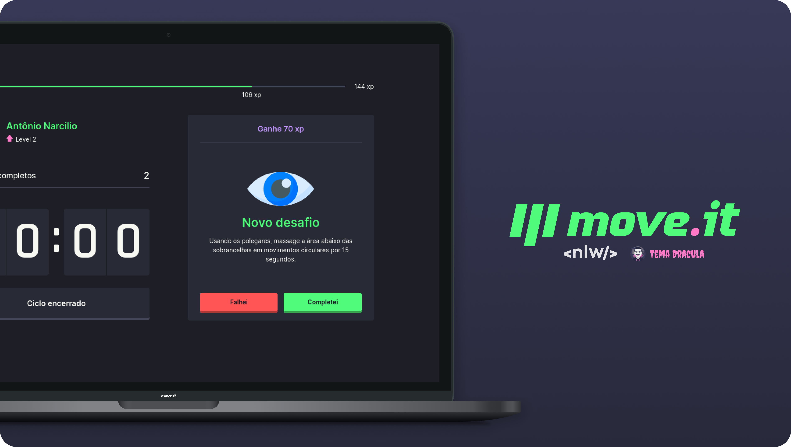
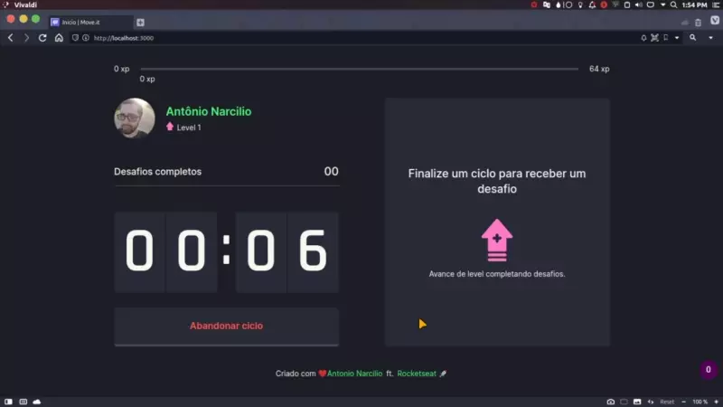
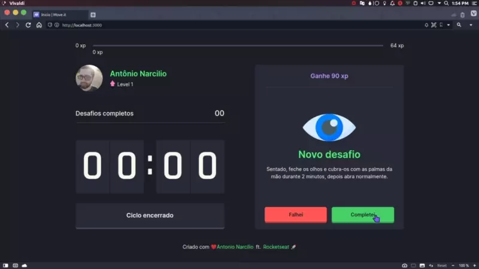
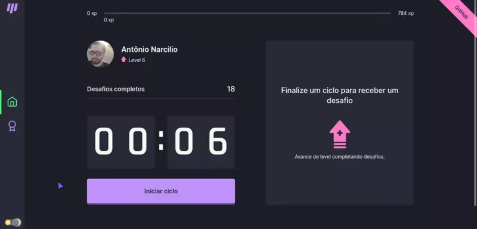
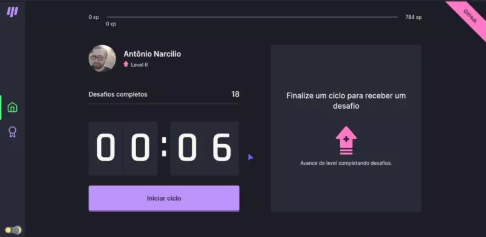
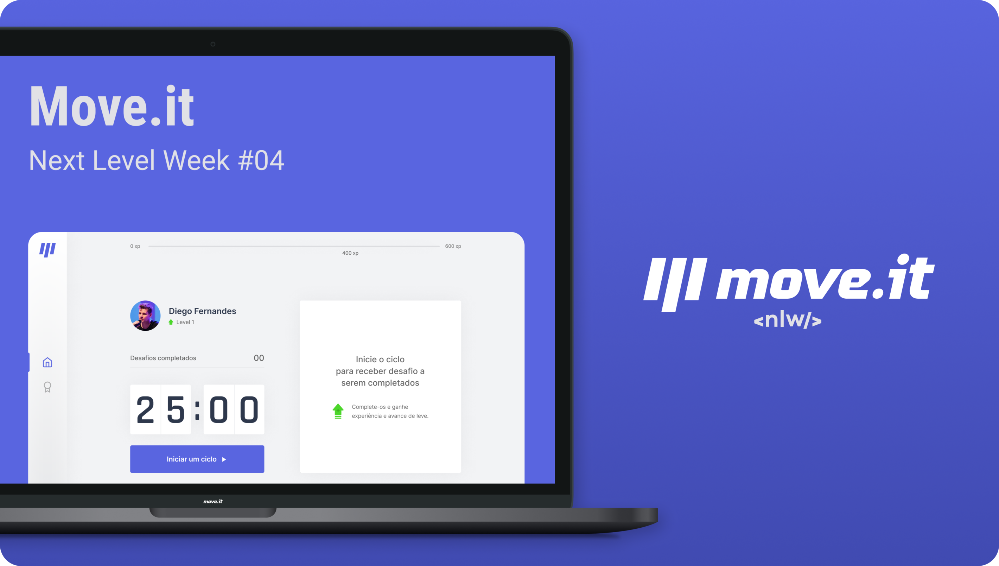

<p align="center">
  <a href="https://antonionarcilio-move-it.vercel.app">
    
  </a>
</p>

<h4 align="center">
  
[Descrição](#desc) ✦ [Tecnologias](#tec) ✦ [Projeto](#Projeto) ✦ [Prototipagem](#prototipagem) ✦ [Rodando localmente](#local) ✦ [Licença](#lic)

<br>


<a href="https://github.com/AntonioNarcilio/move-it/blob/master/LICENSE">
 
</a>


<br>

</h4>

<br>

<h2 id="desc">
💟 Sobre o projeto
</h2>

<p align="justify">
O <b>Move it</b> é uma aplicação desenvolvida com o intuito de ajudar aqueles que passam um bom tempo à frente do computador, como é o caso de nós <i>desenvolvedores</i> 👨‍💻.
<br/>
O que acontece é que essas pessoas com o passar do tempo, acabam desenvolvendo certos problemas gerados por esse uso excessivo, seja eles nas articulações ou nos olhos gerando problema de visão. Com isso o <i>Move it</i> entra para ajudar, unido a <i><u> técnica de pomodoro</u></i> com os exercícios/alongamentos que "ajudam a evitar esse problema citado acima". Tudo isso junto em uma aplicação que usa a gamificação para deixar os desafios mais divertidos.
</p>

<h2 id="tec">
🛸 Tecnologias
</h2>

<a href="https://reactjs.org">
 
</a>

<br/>

<p align="left">
<a href="https://nextjs.org">
 
</a>

<br/>

<a href="https://www.typescriptlang.org/download">
 
</a>

<br/>

<a href="https://styled-components.com">
 
</a>

<br/>

<a href="https://vercel.com">
 
</a>

<br>

<a href="https://www.figma.com/file/cniET9Xo3ZIwoqJ4PWcovu/Move.it-1.0?node-id=160%3A2761">
 
</a>

<br>

<a href="https://www.framer.com/motion/">
 
</a>

<br>

<a href="https://lottiefiles.com">
 
</a>

<br>

<h2>⚔ Funcionalidades</h2>

- [x] Opção de `Iniciar um ciclo` para receber um desafio.
- [x] `Barra de progresso` (xp) do usuário atual.
- [x] `Numero de desafios concluído`.
- [x] `Receber um desafio`, quando o tempo estipulado (25 min) do ciclo chegar ao fim.
- [x] `Notificação` quando o ciclo chega ao fim.
- [x] Opções de `desafio concluído` ou `desafio não concluído` ao receber um desafio.
- [x] Disponibilidade para `iniciar um novo ciclo` ao selecionar desafio não concluído.
- [x] `Receber experiencia` ao concluir um desafio.
- [x] `Subir de nível` ao obter a quantidade estipulada para ir para o próximo level.
- [x] `Animação` ao subir de level.
- [x] `Navegação` entre pagina pelo side bar.
- [x] `Temas` dark (dracula) e light (nlw).

<br>

<h2 id="Projeto">
👔 Projeto
</h2>

<a href="https://antonionarcilio-move-it.vercel.app">

</a>
<h6 align="center">Clique na imagem para visualizar a aplicação</h6>

<br>

<h2>🖥 Capturas de tela</h2>

<table>
  <tr align="center">
    <td><h5>Notificação</h5></td>
    <td><h5>Subindo de level</h5></td>
  </tr>
  <tr>
    <td><a href="./.github/notification.webp?raw=true"></a></td>
    <td><a href="./.github/levelup.webp?raw=true"></a></td>
  </tr>
  <tr align="center">
    <td><h5>Temas dark / light</h5></td>
    <td><h5>Animação de carregamento</h5></td>
  </tr>
  <tr>
    <td><a href="./.github/dark-and-light-mode.webp?raw=true"></a></td>
    <td><a href="./.github/load-animation.webp?raw=true"></a></td>
  </tr>
</table>

<br>

<h2 id="prototipagem">
✈ Prototipagem
</h2>

<a href="https://www.figma.com/file/cniET9Xo3ZIwoqJ4PWcovu/Move.it-1.0?node-id=160%3A2761">

</a>
<h6 align="center">Clique na imagem para ver o projeto no figma</h6>

<br>

<h2 id="local">
⚛ Rodando aplicação localmente
</h2>

> **⚠ Atenção !** <br> Antes de prosseguir com o passo a passo abaixo você precisa ter instalado em sua máquina o gerenciador de pacote [Yarn](https://classic.yarnpkg.com/en/docs/install) e o [Git](https://git-scm.com).

<br>

> 📝 Clonando o repositório e entrando no diretório criado.

```shell
git clone git@github.com:antonionarcilio/move-it.git && cd move-it
```

> 📝 Baixando / Instalando dependências.

```shell
yarn setup
```

> 📝 Rodando Aplicação

```shell
yarn dev
```

> Pronto 🎉 se tudo ocorreu conforme o esperado 😁 a aplicação estará
> rodando na porta 3000. Basta acessar o endereço no navegador
> http://localhost:3000 e você verá a aplicação funcionando.

<br>

<h2 id="lic">
📃 Licença
</h2>

Este projeto esta sobe a licença [MIT](./LICENSE).

created by [Antonio Narcilio](https://github.com/AntonioNarcilio) ft. [Rocketseat](https://github.com/Rocketseat)
