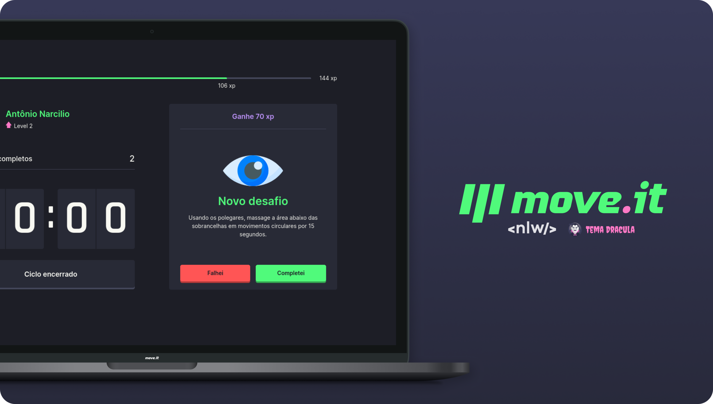

  

<h4 align="center">

[Descrição](#desc) ✦ [Tecnologias](#tec) ✦ [Projeto](#Projeto) ✦ Prototipagem ✦ Rodando localmente ✦ [Licença](#lic)

</h4>

 

<h2 id="desc">
💟 Sobre o projeto
</h2>

O <b>Move it</b> é uma aplicação desenvolvido com o intuito de ajudar aqueles que passam um bom tempo à frente do computador, como é o caso de nós <i>desenvolvedores</i> 👨‍💻.
 
O que acontece é que essas pessoas com o passar do tempo, acabam desenvolvendo certos problemas gerados por esse uso excessivo, seja eles nas articulações ou nos olhos gerando problema de visão. Com isso o <i>Move it</i> entra para ajudar, unido a <i><u> técnica de pomodoro</u></i> com os exercícios/alongamentos que "ajudam a evitar esse problema citado acima". Tudo isso junto em uma aplicação que usa a gamificação para deixar os desafios mais divertidos.

<h2 id="tec">
🛸 Tecnologias
</h2>

 

 

 

 

<h2 id="Projeto">
👔 Projeto
</h2>

<h2 id="lic">
📃 Licença
</h2>

Este projeto esta sobe a licença [MIT](./LICENSE).

created by [Antonio Narcilio](https://github.com/AntonioNarcilio) ft. [Rocketseat](https://github.com/Rocketseat)
